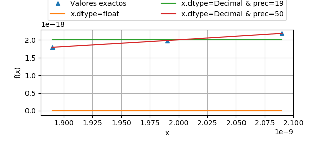

# MCOC-Proyecto-0
MCOC-Proyecto-0


## ‣ loss-of-significance.py

Programa que muestra el fenomeno de la perdidad de significancia con el comportamiento al calcular la funcion sqrt(x^2+1)-1 cuando x tiende a cero, con dos diferentes formatos de numeros, donde, por las aproximaciones automaticas de cada formato.

Se implementan y comparan 3 ideas:

 1. x con formato por defecto float (float64) de la librería numpy. 
 2. x con formato de la librería decimal y precisión = 19 dígitos.
 3. x con formato de la librería decimal y precisión = 50 dígitos.
NOTA: Tambien se usan las operaciones correspondientes a la librería ( Ej.: 1. numpy.sqrt(*arg*) ; 2. Decimal(*arg*).sqrt() )

### Resultados

Se muestra el resultado de la funcion para los distintos casos y para el resultado teorico obtenido.

Abajo se muestra como va creciendo el valor de la funcion para mayores valores de x, mientras que para la operación por defecto siempre se mantiene en cero. Esto ocurre debido a la perdida de significancia en la operacion resta para números en potencias de 10 muy negativas, es decir, que tienden a cero.



Output de la consola:
```
  Valores esperados: [1.7860499999999e-18, 1.9800499999999e-18, 2.1840499999999e-18]

  Valores con formato "float" y libreria "numpy": [0.0, 0.0, 0.0]

  Valores con libreria "decimal" y precision = 19: [2e-18, 2e-18, 2e-18]

  Valores con libreria "decimal" y precision = 50: [1.78605e-18, 1.9800499999999997e-18, 2.18405e-18]
```

### Conclusiones
Se puede notar que los resultados con la librería decimal son se acercan mucho más a los reales, pero aun así se puede regular el nivel de precisión deseado, mientras que el formato float simplemente trunca a cero. Con el gráfico se puede notar que a medida que aumenta x, el error es mayor, ya que las rectas se separan más.
De los distintos casos se aprecia que con una precisión de 50 dígitos ya es prácticamnete igual a los valores esperados.
Cabe destacar que los "valores esperados" también estan truncados en cierto punto, por lo que puede ocurrir que algún valor con precisión = 50 sea más exacto que el valor objetivo.
